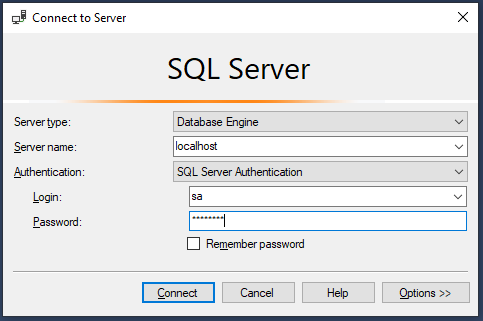
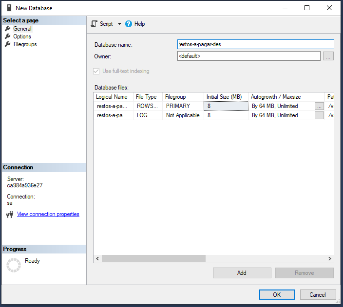
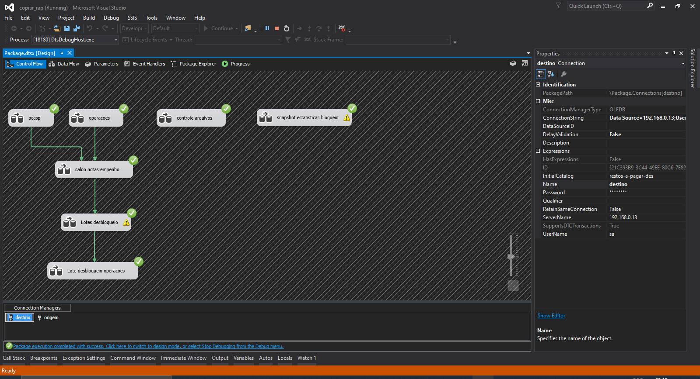
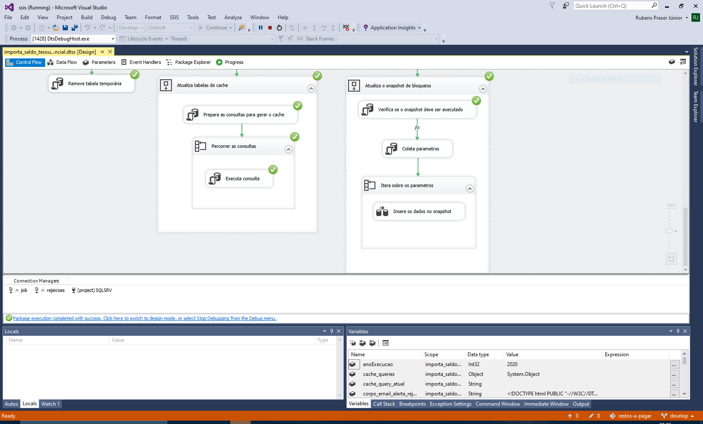
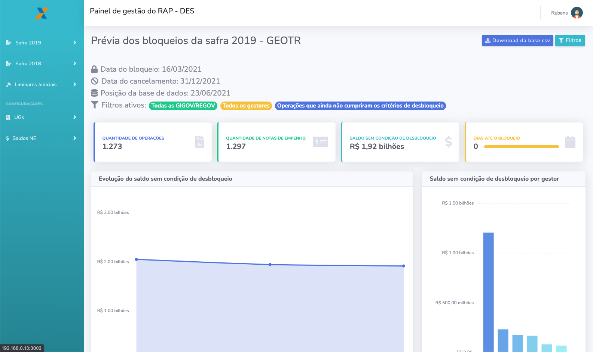

# Restos a pagar

## 1. Sobre o projeto

Este projeto foi desenvolvido com o intuito de suprir as necessidades da SUDEP, GEOTR e da rede de governo (GIGOV/REGOV) no que tange o gerenciamento dos restos a pagar.

Informações sobre o processamento dos restos a pagar, sua definição e suas regras podem ser encontradas no [Decreto Nº 93.872, de 23 de dezenbro de 1986](http://www.planalto.gov.br/ccivil_03/decreto/d93872.htm).

---

## 2. Sobre este repositório

Este é um [monorepo](https://medium.com/ifood-tech/como-funciona-um-monorepo-em-javascript-46abaa8f8b13#:~:text=Monorepo%20%C3%A9%20uma%20solu%C3%A7%C3%A3o%20para,conta%20de%20tamanho%20e%20complexidade.&text=Por%20exemplo%2C%20Babel%20%C3%A9%20uma,que%20%C3%A9%20estruturada%20em%20monorepo.) que contém todos o código necessário para a execução da aplicação. Está organizado na seguinte estrutura de pastas:

```
README.md
├── backend
├── devtools
├── docker-compose.yml
├── mocks
├── mockups
├── ssis
└── web
```

Para melhor compreensão do projeto, segue uma breve descrição do código contido em cada uma das pastas deste repositório

- **README.md**: Este arquivo.
- **backend**: Código fonte a api responsável pela lógica de negócios e por servir os dados.
- **devtools**: Ferramentas que auxiliam durante o processo de desenvolvimento.
- **docker-compose.yml**: Arquivo de configuração dos containers do Docker.
- **mocks**: Arquivo JSON para ser importado no Mockoon e criar algumas.requisições fake para auxiliar durante o processo de desenvolvimento.
- **mockups**: Protótipos de baixa fidelidade do front end feitos com o Balsamiq Mockups.
- **ssis**: Pacote do SQL Server Integration Services (SSIS) responsável por fazer a manutenção do banco de dados da aplicação.
- **web**: Código fonte do frontend.

---

## 3. Getting Started

## 3.1. Ferramentas necessárias

Para poder trabalhar nessa base de código você precisará ter todas as ferramentas listas abaio instaladas e configuradas no seu computador:

- [Balsamiq Mockups](https://balsamiq.com/wireframes/) - Balsamiq mockups é uma ferramenta de prototipagem de UI de baixa fidelidade.

- [Docker](https://www.docker.com/products/docker-desktop) - Essa é uma tecnologia de conteinerização, ou seja, pode ser utilizada para criar containers. Cada container funciona como uma máquina virtual modular. Como ela é leve e flexível, pessoas gestoras de TI conseguem implantar, copiar e migrar ambientes de trabalho facilmente.

- [Docker-compose](https://github.com/docker/compose) - é uma ferramenta para executar aplicativos de vários contêineres no Docker definidos usando o formato de arquivo Compose. Um arquivo Compose é usado para definir como um ou mais containers que compõem seu aplicativo são configurados. Depois de ter um arquivo Compose, você pode criar e iniciar seu aplicativo com um único comando: docker-compose up.

- [Mockoon](https://mockoon.com/) - Mockoon é a maneira mais fácil e rápida para rodar servidores de API mockadas localmente. Sem deploy remoto, sem criação de contas, grátis, open-source e cross plataforma., open source and cross-platform.

- [Node.js](https://nodejs.org/en/) - Como uma runtime Javascript asyncrona orientada a eventos, Node.js foi desenvolvida para construir aplicações de rede escaláveis.

- [SQL Server Management Studio](https://docs.microsoft.com/pt-br/sql/ssms/download-sql-server-management-studio-ssms?view=sql-server-ver15) - O SSMS (SQL Server Management Studio) é um ambiente integrado para gerenciar qualquer infraestrutura de SQL, do SQL Server para o Banco de Dados SQL do Azure.

- [Visual Studio Code](https://code.visualstudio.com/) - Editor de texto (Pode ser substituído por outro da sua preferência)

- [Visual Studio Community](https://visualstudio.microsoft.com/pt-br/vs/community/) - Um IDE gratuito, completo e extensível para a criação de aplicativos modernos para Android, iOS e Windows, bem como aplicativos Web e serviços de nuvem.

- [Yarn](https://yarnpkg.com/) - é um gerenciador de pacotes que também atua como gerente de projeto. Quer você trabalhe em projetos únicos ou grandes monorepos, como um hobbyist ou um usuário corporativo, nós temos o que você precisa.

## 3.2 Instalação

Após clonar este repositório no seu computador acesse a pasta onde os arquivos foram copiados e execute todas os passos abaixo para configurar o backend, frontend e o banco de dados de desenvolvimento:

## 3.2.1 Backend

Para que o backend funcione corretamente é necessário criar um arquivo de configuração `backend/.env` com todas as chaves descritas no arquivo `backend/.env.example`.

## 3.2.2 Frontend

Para que o frontend funcione corretamente é necessário criar um arquivo de configuração `web/.env` com todas as chaves descritas no arquivo `web/.env.example`.

## 3.2.3 Executando os continers da aplicação

Usando um terminal de comando (poweshell, bash, zsh...) acesse a pasta onde o repositório foi clonado:

```
cd restos-a-pagar
```

Uma vez dentro da pasta execute o docker compose para fazer o download e iniciar todos os container da aplicação:

```
docker-compose up -d
```

Neste ponto se você executar o comando abaixo deve ver os seguintes containers docker rodando na sua máquina:

```
docker ps
```

- **web**: Frontend desta aplicação.
- **backend**: Backend desta aplicação.
- **database**: Banco de dados desta aplicação.
- **smtp**: Servidor SMTP responsável por enviar e fornecer previsualização dos e-mails enviados pela aplicação.
- **auth-api**: Api responsável pela autenticação dos usuários.

## 3.2.3 Banco de dados

Com os container rodando, o próximo passo é executar as migrations para criar as tabelas e as views do banco de dados.

Abra o `SQL Server Management Studio` e se conecte ao container de banco de dados usando as seguintes credenciais (as mesmas existentes dentro do arquivo `docker-compose.yml`):

```
  hostname:
  username: sa
  password: S3cr3t00
```



Em seguida crie um banco de dados com o nome `restos-a-pagar-des`



Por fim execute o comandos abaixo para se conectar ao container do backend e executar as migrations do banco de dados e semear os primeiros dados:

```
docker-compose exec backend bash
vendor/bin/phinx migrate
vendor/bin/phinx seed:run
exit
```

## 3.2.3.1 Sincronizando com o banco de dados de produção

Para ter localmente um banco de dados carregado com os dados de produção é necessário fazer uma cópia desses dados para sua máquina local.

Isto será feito executando o pacote SSIS `copiar-rap` que encontra-se na pasta `devtools`.

Configure a conexão destino apontando para a base de dados `restos-a-pagar-des` que foi criada no passo 3.2.3 e a conexão origem apontando para a base de dados `DB5385_RESTOS_A_PAGAR` no servidor `DF7436SR464`.

Feitas das devidas configurações execute o pacote.



## 3.2.3.2 Criando as tabelas de cache da aplicação

Este é o último passo para ter o banco de dados funcionando e é tão simples quanto o passo anterior. Abra o arquivo `ssis/ssis.sln` e execute o pacote `importa-saldo-tesouro-gerencial.dtsx`. Lembre-se de alterar a conexão com o banco de dados para a apontar para a base de dados `restos-a-pagar-des` que criamos no passo 3.2.3.



## 3.3 Acessando a aplicação localmente.

Para acessar a aplicação basta visitar o endereço http://localhost:3002


